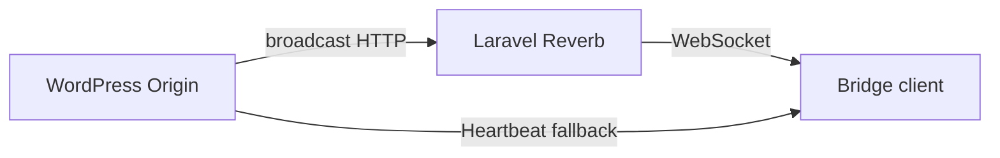

# Broadcasting

Helm's broadcast system is the game-facing event delivery layer. It is inspired by Laravel broadcasting and Laravel Reverb, but the first implementation should work entirely inside WordPress by using the WordPress Heartbeat API as a polling transport.

The long-term direction is to run a Pusher-compatible WebSocket server alongside the WordPress Origin, most likely Laravel Reverb. WordPress remains authoritative for game state. Reverb only delivers events to subscribed clients.

Shove is a related WordPress broadcasting project that explores connecting WordPress to Pusher or Laravel Reverb, exposing a server-side broadcast API, providing channel authorization, and giving the browser a configured Laravel Echo client. Helm's first version does not need to depend on Shove, but that style of integration is useful context for the future WebSocket transport shape.

## Goals

-   Keep game code transport-agnostic. Game systems publish events, not Heartbeat responses or WebSocket messages.
-   Support WordPress-only delivery first through Heartbeat polling.
-   Preserve a path to Laravel Reverb without rewriting event producers or frontend event handlers.
-   Broadcast small, canonical snapshots when that is useful.
-   Broadcast pull hints when data is heavy, embedded, relational, or better loaded through existing REST endpoints.
-   Keep the client cursor tied to successfully applied broadcast events, not to the latest server time.

## Shape

Broadcasting has four concepts:

| Concept | Purpose |
| --- | --- |
| Channel | Who may receive the event. Example: `private-ship.{shipId}`. |
| Event type | What happened. Example: `ship.action.updated`. |
| Payload | A snapshot, patch, or pull hint. |
| Cursor | A durable ordered position in the broadcast stream. |

Heartbeat and Reverb should deliver the same logical event shape. Only the transport changes.

```json
{
  "id": 991,
  "channel": "private-ship.45",
  "type": "ship.action.updated",
  "payload": {
    "strategy": "snapshot",
    "action": {
      "id": 123,
      "ship_post_id": 45,
      "type": "jump",
      "status": "partial"
    }
  }
}
```

## Payload strategies

### Snapshot

Use a snapshot when the changed data is small, self-contained, canonical, and already in a shape the client store can receive.

Good candidates:

-   `ship.action.updated` with the full ship action record.
-   `ship.state.updated` with operational fields from the ship state table.

A ship state snapshot should describe the operational state owned by the ship state table, such as node, power timestamps, hull integrity, power mode, and current action id. It should not pretend to be the full REST ship resource if that endpoint also includes cargo, embedded systems, or other related data.

### Patch

Use a patch when only a few fields changed and the patch contract is obvious.

Example:

```json
{
  "strategy": "patch",
  "ship_id": 45,
  "patch": {
    "node_id": 12,
    "current_action_id": null
  }
}
```

Patches should only target stores that have explicit patch receive actions. Avoid implicit partial updates against full REST response types.

### Pull hint

Use a pull hint when the data is large, embedded, relational, derived, expensive, or already has a canonical REST loading path.

Good candidates:

-   `ship.systems.changed`, fetch ship systems with product embeds.
-   `ship.cargo.changed`, fetch cargo or the full ship endpoint.
-   `navigation.discovery.changed`, fetch canonical user edges and nodes.
-   Future DSP or combat views where the payload could become large.

Example:

```json
{
  "strategy": "pull",
  "resources": [
    { "type": "ship.systems", "ship_id": 45 }
  ]
}
```

## WordPress Heartbeat transport

The first transport should use WordPress Heartbeat as a polling adapter over the broadcast stream.

Client request:

```json
{
  "cursor": 990
}
```

Server response:

```json
{
  "cursor": 991,
  "events": [
    {
      "id": 991,
      "channel": "private-ship.45",
      "type": "ship.action.updated",
      "payload": { "strategy": "snapshot", "action": {} }
    }
  ]
}
```

If there are no events after the supplied cursor, return an empty `events` list. The client should not treat server time as a broadcast cursor.

The client should advance its stored cursor only after it has successfully applied all returned events. If applying an event requires a REST fetch and that fetch fails, the old cursor remains so the next heartbeat can retry.

## WebSocket transport

The future WebSocket transport should deliver the same events through a Pusher-compatible server such as Laravel Reverb.



WordPress will still own channel authorization and game state. The WebSocket server distributes events. REST remains necessary for initial load, reconnect catch-up, and pull hint resources.

A Shove-style integration would let WordPress call a broadcast API and let the browser subscribe with Laravel Echo. Helm should keep event producers and client handlers independent of whether events arrived through Heartbeat or Echo.

## Channel direction

Initial channels can stay ship-scoped because Helm currently assumes one ship per logged-in user.

-   `private-ship.{shipId}` for ship state and action updates.
-   `private-ship.{shipId}.navigation` if navigation updates need separation later.
-   `private-node.{nodeId}` or `private-system.{nodeId}` for future local-space awareness.

Every channel is private. Authorization should be based on WordPress login, ship ownership, location, and later crew or fleet permissions.

## Relationship to ship action broadcasting

`docs/dev/ship-action-broadcasting.md` describes the narrower ship action case. This document is the broader architecture direction. Ship actions remain a good snapshot event because a ship action record is small and self-contained. Other domains may choose snapshots, patches, or pull hints depending on the resource.
